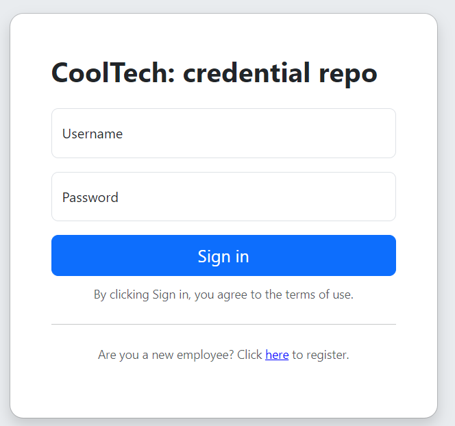
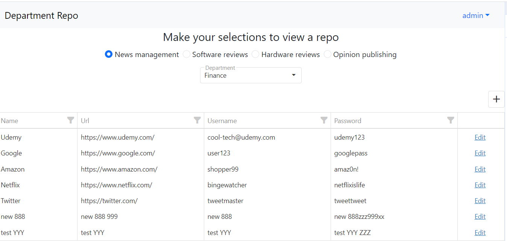
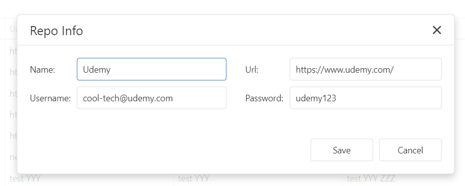
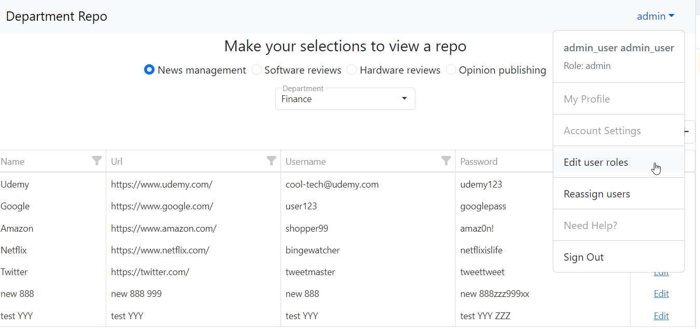
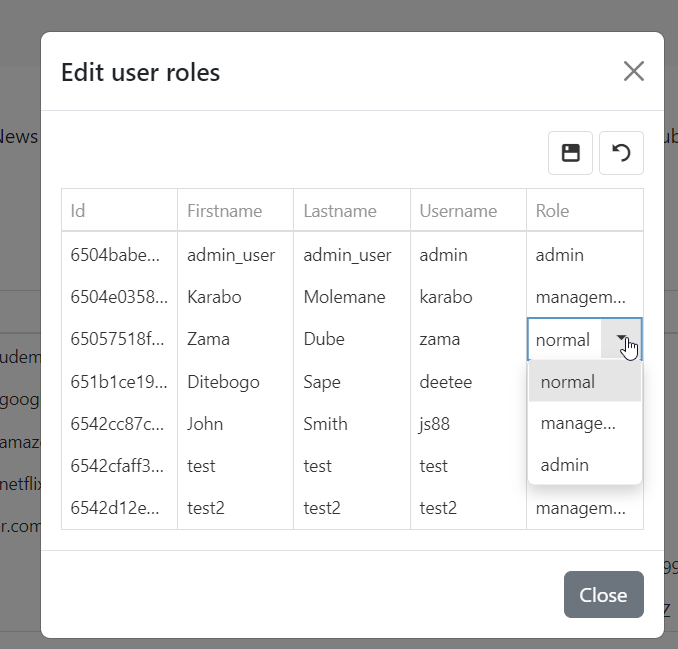
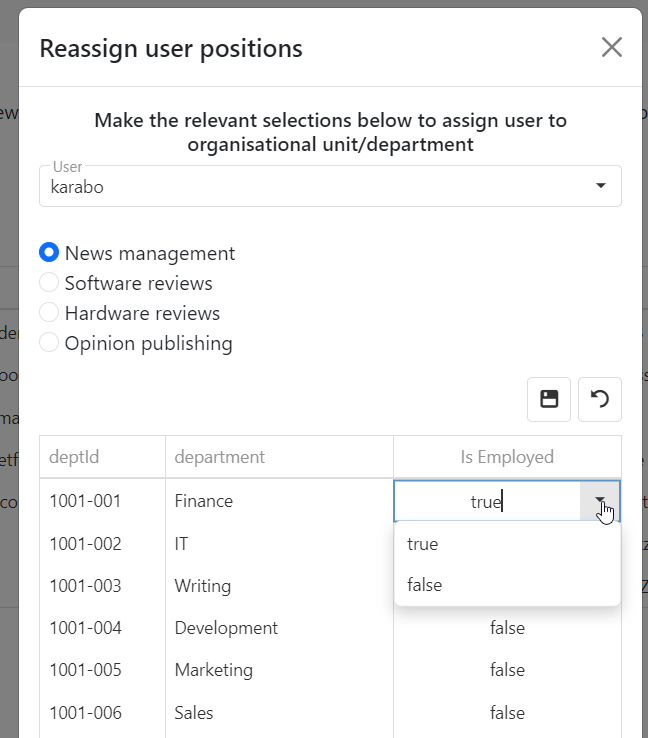

<!-- Improved compatibility of back to top link: See: https://github.com/othneildrew/Best-README-Template/pull/73 -->
<a name="readme-top"></a>


[![Contributors][contributors-shield]][contributors-url]
[![Forks][forks-shield]][forks-url]
[![Stargazers][stars-shield]][stars-url]
[![Issues][issues-shield]][issues-url]
[![MIT License][license-shield]][license-url]
[![LinkedIn][linkedin-shield]][linkedin-url]


<!-- PROJECT LOGO -->
<br />
<div align="center">
  <a href="https://github.com/KaraboMolemane/authentication-manager">
    
  </a>

<h3 align="center">Authentication manager</h3>
  <p align="center">
    This is a React app (frontend) that uses Express and Mongoose (backend) to manage user registration and login using JSON Web Tokens (JWT). Users have different roles (rights) within the application such as reassigning other users to different organizational units and departments. Additionaly, JWT tokens are are checked in the backend to ensure the user has the access/rights to perform specific operations.
    <br />
    <a href="https://github.com/KaraboMolemane/authentication-manager"><strong>Explore the docs »</strong></a>
    <br />
    <br />
    <a href="https://github.com/KaraboMolemane/authentication-manager">View Demo</a>
    ·
    <a href="https://github.com/KaraboMolemane/authentication-manager/issues">Report Bug</a>
    ·
    <a href="https://github.com/KaraboMolemane/authentication-manager/issues">Request Feature</a>
  </p>
</div>


<!-- TABLE OF CONTENTS -->
<details>
  <summary>Table of Contents</summary>
  <ol>
    <li>
      <a href="#about-the-project">About The Project</a>
      <ul>
        <li><a href="#built-with">Built With</a></li>
      </ul>
    </li>
    <li>
      <a href="#getting-started">Getting Started</a>
      <ul>
        <li><a href="#prerequisites">Prerequisites</a></li>
        <li><a href="#installation">Installation</a></li>
      </ul>
    </li>
    <li><a href="#usage">Usage</a></li>
    <li><a href="#roadmap">Roadmap</a></li>
    <li><a href="#contributing">Contributing</a></li>
    <li><a href="#license">License</a></li>
    <li><a href="#contact">Contact</a></li>
    <li><a href="#acknowledgments">Acknowledgments</a></li>
  </ol>
</details>


<!-- ABOUT THE PROJECT -->
## About The Project

<p align="right">(<a href="#readme-top">back to top</a>)</p>

### Built With

* [![React][React.js]][React-url]
* [![Expressjs][expressjs.com]][Express-url]
* [![Bootstrap][Bootstrap.com]][Bootstrap-url]
* [![DevExpress][js.devexpress.com]][devexpress-url]

<p align="right">(<a href="#readme-top">back to top</a>)</p>


<!-- GETTING STARTED -->
## Getting Started


### Prerequisites

Below is a list of things you need to use the project and how to install them.
* MongoDB
  * To use this project you will need a Mongo DB with some minimal data in it. 
  *  If you do not have MongoDB account already, create a new one [here](https://www.mongodb.com/)
  * Inside MongoDB, create one document for the [Organisation Unit Model](https://github.com/KaraboMolemane/authentication-manager/blob/b4c40fc2c9b965f70f82d1ce5fc03a9a28b96b38/models/organisational_unit.model.js) and the [User Model](https://github.com/KaraboMolemane/authentication-manager/blob/b4c40fc2c9b965f70f82d1ce5fc03a9a28b96b38/models/user.model.js) as per the models.
  * The User Model should have at least one admin-user (super user) that will have rights to assign user roles and assign users to departments.
  * In the root folder, create a `.env` file and add your connection string as follows: 

      ```
      MONGODB_URI="your-mongodb-uri-here"
      ```
  * NB!!! Remember not to never publish your connection string to GitHub. With that said, always ensure that the `.env` file is included in the `.gitignore` file.


### Installation

* Clone the repo
   ```sh
   git clone https://github.com/KaraboMolemane/authentication-manager.git
   ```
* Run Back end
  * Open the project in a terminal and install NPM packages
    ```sh
    npm install
    ```
  * Once the installtion is done, you can start the backend by typing the following:
    ```sh
    npm start
    ```
  * The back end runs on http://localhost:8080/
  * The project uses [nodemon](https://www.npmjs.com/package/nodemon) to automatically reload every time a change is made and saved.

* Run Front end
  * Open another instance of the terminal on your project and navigate to the front end by typing
    ```sh
     cd frontend
    ```
  * Install NPM packages for the front end
    ```sh
     npm install
    ```
  * Once the installtion is done, you can start the frontend by typing the following:
    ```sh
    npm start
    ```
  * The front end runs on http://localhost:3000/ and will automatically open on your default browser. if this does not happen, simply open http://localhost:3000/ on your preffered browser.
  * The project uses [nodemon](https://www.npmjs.com/package/nodemon) to automatically reload every time a change is made and saved.

<p align="right">(<a href="#readme-top">back to top</a>)</p>


<!-- USAGE EXAMPLES -->
## Usage

Once the project is opened in your browser. You will be presented with a login screen with an option to register if you do not have an account.  

<div align="center">
    
</div>

Register as a user and login. At this point, you will need the admin user to assign the newly registered user to at least one department within an organisational unit (OU). Depending on the user role/rights, the newly registered user will then be able to view, add, and edit departmental repo entries. Most employees are only part of one OU and one division with it, but an employee can bee part of more than one OU and division. Below are some business rules for the user roles: 
 * Normal users can read the credential repository, and add new credentials in.
 * Management users can do the above plus update credentials
 * Admin users can do the above plus they can assign and unassign users from divisions and OUs. They can also change the user role of any user.

After logging in, select the organisational unit and deapartment that you were assigned to view the repo. 

<div align="center">
    
</div>

Management users have the ability to add and edit repo credentials. 

<div align="center">
    
</div>

Admin users have the ability to assign roles to users and assign and unassign users from divisions and OUs. 

<div align="center">
    
</div>

<div align="center">
    
</div>
<div align="center">
    
</div>

_For more examples, please refer to the [Documentation](https://example.com)_

<p align="right">(<a href="#readme-top">back to top</a>)</p>

<!-- ROADMAP -->
## Roadmap

- On user select box, we plan to append "(firstname+lastname)" to the username
- Add the ability to delete a single repo
- Make authorisation key  or session expire after some inactivity
- Revisit the refresh of tables after reassigning a user 


See the [open issues](https://github.com/KaraboMolemane/authentication-manager/issues) for a full list of proposed features (and known issues).

<p align="right">(<a href="#readme-top">back to top</a>)</p>

<!-- CONTRIBUTING -->
## Contributing

Contributions are what make the open source community such an amazing place to learn, inspire, and create. Any contributions you make are **greatly appreciated**.

If you have a suggestion that would make this better, please fork the repo and create a pull request. You can also simply open an issue with the tag "enhancement".
Don't forget to give the project a star! Thanks again!

1. Fork the Project
2. Create your Feature Branch (`git checkout -b feature/AmazingFeature`)
3. Commit your Changes (`git commit -m 'Add some AmazingFeature'`)
4. Push to the Branch (`git push origin feature/AmazingFeature`)
5. Open a Pull Request

<p align="right">(<a href="#readme-top">back to top</a>)</p>


<!-- LICENSE -->
## License

N/A

<p align="right">(<a href="#readme-top">back to top</a>)</p>


<!-- CONTACT -->
## Contact

Karabo Molemane - https://www.linkedin.com/in/karabo-molemane/

Project Link: [https://github.com/KaraboMolemane/authentication-manager](https://github.com/KaraboMolemane/authentication-manager)

<p align="right">(<a href="#readme-top">back to top</a>)</p>


<!-- ACKNOWLEDGMENTS -->
## Acknowledgments

* [Othneil Drew](https://github.com/othneildrew/Best-README-Template)


<p align="right">(<a href="#readme-top">back to top</a>)</p>


<!-- MARKDOWN LINKS & IMAGES -->
<!-- https://www.markdownguide.org/basic-syntax/#reference-style-links -->
[contributors-shield]: https://img.shields.io/github/contributors/KaraboMolemane/authentication-manager.svg?style=for-the-badge
[contributors-url]: https://github.com/KaraboMolemane/authentication-manager/graphs/contributors
[forks-shield]: https://img.shields.io/github/forks/KaraboMolemane/authentication-manager.svg?style=for-the-badge
[forks-url]: https://github.com/KaraboMolemane/authentication-manager/network/members
[stars-shield]: https://img.shields.io/github/stars/KaraboMolemane/authentication-manager.svg?style=for-the-badge
[stars-url]: https://github.com/KaraboMolemane/authentication-manager/stargazers
[issues-shield]: https://img.shields.io/github/issues/KaraboMolemane/authentication-manager.svg?style=for-the-badge
[issues-url]: https://github.com/KaraboMolemane/authentication-manager/issues
[license-shield]: https://img.shields.io/github/license/KaraboMolemane/authentication-manager.svg?style=for-the-badge
[license-url]: https://github.com/KaraboMolemane/authentication-manager/blob/master/LICENSE.txt
[linkedin-shield]: https://img.shields.io/badge/-LinkedIn-black.svg?style=for-the-badge&logo=linkedin&colorB=555
[linkedin-url]: https://www.linkedin.com/in/karabo-molemane/
[product-screenshot]: images/screenshot.png
[Next.js]: https://img.shields.io/badge/next.js-000000?style=for-the-badge&logo=nextdotjs&logoColor=white
[Next-url]: https://nextjs.org/
[React.js]: https://img.shields.io/badge/React-20232A?style=for-the-badge&logo=react&logoColor=61DAFB
[React-url]: https://reactjs.org/
[Vue.js]: https://img.shields.io/badge/Vue.js-35495E?style=for-the-badge&logo=vuedotjs&logoColor=4FC08D
[Vue-url]: https://vuejs.org/
[Angular.io]: https://img.shields.io/badge/Angular-DD0031?style=for-the-badge&logo=angular&logoColor=white
[Angular-url]: https://angular.io/
[Svelte.dev]: https://img.shields.io/badge/Svelte-4A4A55?style=for-the-badge&logo=svelte&logoColor=FF3E00
[Svelte-url]: https://svelte.dev/
[Laravel.com]: https://img.shields.io/badge/Laravel-FF2D20?style=for-the-badge&logo=laravel&logoColor=white
[Laravel-url]: https://laravel.com
[Bootstrap.com]: https://img.shields.io/badge/Bootstrap-563D7C?style=for-the-badge&logo=bootstrap&logoColor=white
[Bootstrap-url]: https://getbootstrap.com
[JQuery.com]: https://img.shields.io/badge/jQuery-0769AD?style=for-the-badge&logo=jquery&logoColor=white
[JQuery-url]: https://jquery.com 
[expressjs.com]: https://img.shields.io/badge/Express-999D7C?style=for-the-badge&logo=express&logoColor=white
[Express-url]: https://expressjs.com
[js.devexpress.com]: https://img.shields.io/badge/DevExpress-1999AD?style=for-the-badge&logo=devexpress&logoColor=white
[devexpress-url]: https://js.devexpress.com
